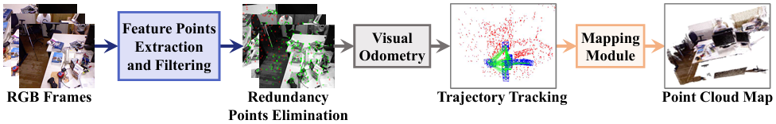
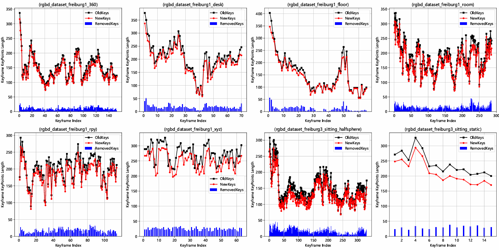

<div align="center">
<h3>GeneA-SLAM: Enhancing SLAM with Genetic Algorithm-Based Feature Points Re-sampling</h1>

<a href="https://ieeexplore.ieee.org/document/10900093/"></a>
<a ></a>
[](https://github.com/qingshufan/GeneA-SLAM/stargazers)
<a href="https://github.com/qingshufan/GeneA-SLAM/network/members">

</a> 
[](https://github.com/qingshufan/GeneA-SLAM/issues)
<a href='https://huggingface.co/datasets/qingshufan/GeneA-SLAM'></a>
[](https://opensource.org/licenses/gpl-3-0)





</div>

This study proposes a genetic algorithm-based feature point resampling module to address uneven feature distribution in SLAM. Integrated with [ORB-SLAM2](https://github.com/raulmur/ORB_SLAM2), GeneA-SLAM optimizes APE/RPE by up to 19.73%/50.10% on TUM datasets with lower runtime, and succeeds in real-scene mapping.

## News
- **2025-01-22:** Accept to ICAIRC 2024!
- **2024-12-20:** Submmited to ICAIRC 2024.

## Our GeneA-SLAM datasets
We have captured a  RGB-D dataset using the [ORBBEC Astra sensor](https://www.orbbec.com/products/structured-light-camera/astra-series/). To ensure compatibility with the [TUM RGB-D dataset](https://cvg.cit.tum.de/data/datasets/rgbd-dataset/download), we provide conversion scripts based on the [OpenNI2 SDK](https://structure.io/openni/), which standardize the dataset format. This allows direct use of the same evaluation tools developed for the TUM dataset. Additionally, we offer trajectory estimates and 3D point clouds generated by our algorithm as reference ground truth. 

Notably, we have also recorded a ROS Melodic-compatible bag file with equivalent functionality. The bag file maintains the same topic structure as the TUM RGB-D dataset but includes only two topics: `RGB` and `Depth`.  You can download the whole dataset from [Google Drive Link](https://drive.google.com/drive/folders/1Hix6slb-lWso1y80IC6CXW9xDhE6Aauu?usp=sharing) or [Huggingface Datasets Link](https://huggingface.co/datasets/qingshufan/GeneA-SLAM). 

The depth images are already registered w.r.t. the corresponding RGB images. The calibration of the RGB camera is the following:
```
fx = 507.292109502834
fy = 526.636687152693
cx = 311.8322920110805
cy = 226.2697397957387
k1 = 0.1577126194040356
k2 = -0.9818469537300319
p1 = -0.009382215272653267
p2 = 0.001344533621560567
k3 = 1.579108437584564
```

## Prerequisites
GeneA-SLAM is developed based on ORB-SLAM2. Tested on Ubuntu 18.04; compatible with other platforms. High-performance hardware is recommended for real-time stability. Below are the core dependencies (largely inherited from ORB-SLAM2 with minor optimizations):

### C++11 or C++0x Compiler
Requires a C++11-compatible compiler (for threading/chrono features).

### Pangolin
For visualization UI: [Install Guide](https://github.com/stevenlovegrove/Pangolin).  

### OpenCV ≥3.2  
For image processing: [Install Guide](http://opencv.org). 

### Eigen3 ≥3.1.0  
For linear algebra (required by g2o): [Install Guide](http://eigen.tuxfamily.org).  

### Thirdparty Libraries (Included)  
- **DBoW2**: Modified for improved place recognition.  
- **g2o**: Modified for optimized non-linear optimization.  
Both are in the `Thirdparty` folder (BSD licensed).  

### ROS (optional)
We recommend using the [automated tool](https://github.com/fishros/install) to install the **Melodic Desktop Full** version of the ROS system on **Ubuntu 18.04**. The step is optional.


## Building GeneA-SLAM
```
git clone https://github.com/qingshufan/GeneA-SLAM
```

We provide a script `build.sh` and `build_ros.sh` to build **GeneA-SLAM**. 
```
cd GeneA-SLAM
chmod +x build.sh
./build.sh
./build_ros.sh
```

## Running GeneA-SLAM datasets

### Normal mode
Please modify the dataset path in the following script before running:
```bash
cd GeneA-SLAM
./Examples/RGB-D/rgbd_tum Vocabulary/ORBvoc.txt Examples/RGB-D/GENEA.yaml [path] [path]/associations.txt
```

### ROS mode
We provide a ROS quick-run script. Before running, please modify **GeneA_SLAM_PATH** (GeneA-SLAM path) and **ROSBAG_PATH** (ROS bag path) in the script. **PLAY_SPEED** (playback speed) depends on your computer's performance.
```bash
cd GeneA-SLAM
chmod +x ros_run.sh
./ros_run.sh
```
## LICENSE

ORB-SLAM2 is released under a [GPLv3 license](https://github.com/raulmur/ORB_SLAM2/blob/master/License-gpl.txt). So Our GeneA-SLAM are under the GPL-3.0 license.

## Citation

If you find this project useful, please consider citing:
```bibtex
@inproceedings{qing2024geneaslam, 
      title={GeneA-SLAM: Enhancing SLAM with Genetic Algorithm-Based Feature Points Re-sampling}, 
      url={http://dx.doi.org/10.1109/icairc64177.2024.10900093}, 
      DOI={10.1109/icairc64177.2024.10900093}, 
        booktitle={2024 4th International Conference on Artificial Intelligence, Robotics, and Communication (ICAIRC)}, 
      publisher={IEEE}, 
      author={Qing, Shufan and Li, Anzhen and Liu, Jiacheng and Gao, Yang and Feng, Mingchen and Nan, Fengtao and Hu, Guoliang and Wu, Jinqiao and Fan, Yingchun}, 
      year={2024}, 
      month=dec, 
      pages={1042–1047} 
}
```